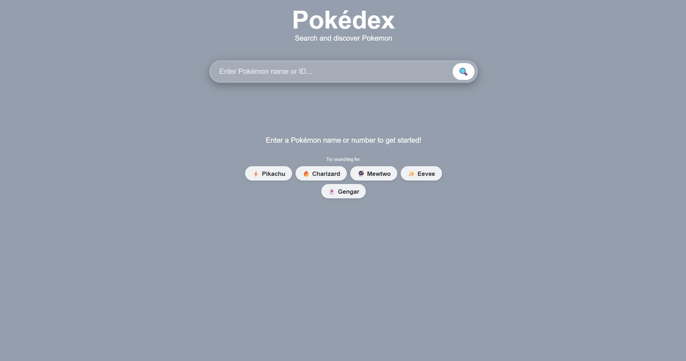
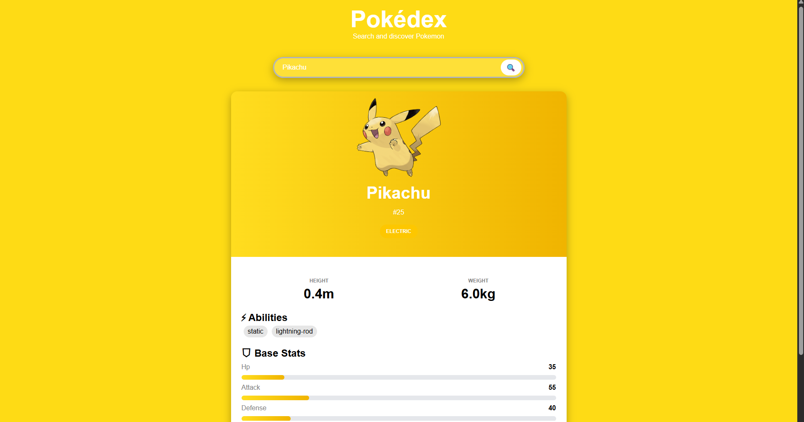
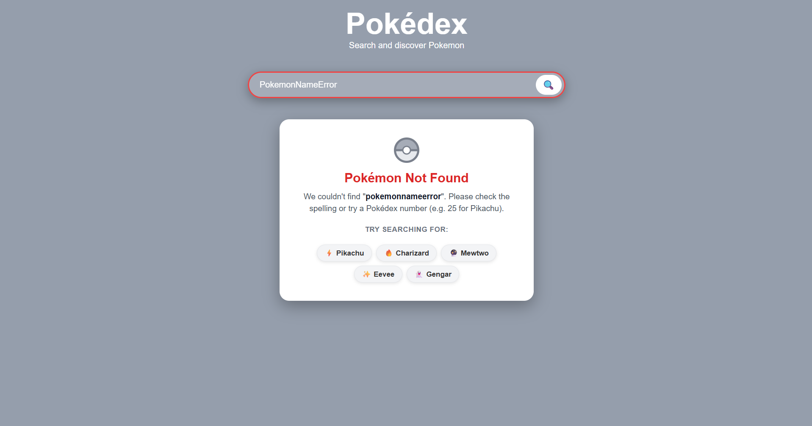

<div align="center">

# ⚡ Pokédex App

**A sleek, interactive Pokédex built with vanilla HTML, CSS, and JavaScript — powered by the PokéAPI.**

[](https://rahulsingh2007.github.io/Pokemon-App/)
[](https://github.com/rahulsingh2007/Pokemon-App)
[](https://pokeapi.co/)

</div>

---

## 📸 Screenshots

Here is a visual walkthrough of the three primary user interface states:

### 1. Initial UI (Landing View)
> Clean and minimal search interface welcoming the user to look know about pokemon.

<div align="center">
  
</div>

<br/>

### 2. After Searching (Pokemon Detail View)
> Comprehensive pokemon detail card displaying height, weight, abilites, and base-stats.

<div align="center">
  
</div>

<br/>

### 3. Error State (Invalid Pokemon Name / Network Issue)
> Informative and user-friendly error card alerting the user when a pokemon cannot be found or invalid input is given.

<div align="center">
  
</div>

---

## 🚀 Features

- 🔍 **Search by name or Pokédex number** — e.g. `pikachu` or `25`
- 🎨 **Dynamic type-based theming** — background, card gradient, and stat bars adapt per Pokémon type across all 18 types
- ✨ **Sprite animation** — pop-in scale animation every time a new Pokémon is loaded
- 💡 **Quick suggestion chips** — clickable one-tap shortcuts on landing and error screens
- 🔄 **Loading state** — animated spinning Pokéball during API fetch, with search button disabled to prevent duplicate requests
- 🛡️ **Rich error handling**:
  - Not Found (404) — shows the searched term in the error message
  - Network/Connection Error — prompts user to check internet
  - Server Error (5xx) — generic fallback message
- 🖼️ **Image fallback chain** — official artwork → front sprite → placeholder Pokéball image
- 📐 **Responsive design** — adapts gracefully from mobile to desktop
- ⚡ **Zero dependencies** — pure HTML, CSS, JS with no build step required

---

## 🎨 Design System & Aesthetics

### Color Palette — Type Colors

The app maps all **18 Pokémon types** to curated color tokens used across the body background, card gradient, and type badge colors:

| Type | Body Color | Badge Color |
|------|-----------|-------------|
| 🔥 Fire | `#FF8604` | `#FF6900` |
| 💧 Water | `#4B9CFF` | `#2B7FFF` |
| 🌿 Grass | `#00DB6F` | `#00C950` |
| ⚡ Electric | `#FEDB15` | `#FDC700` |
| 🔮 Psychic | `#F95DAF` | `#F6339A` |
| 👻 Ghost | `#9410F2` | `#8200DB` |
| 🐉 Dragon | `#5D58FB` | `#4F39F6` |
| 🌙 Dark | `#455161` | `#364153` |
| ❄️ Ice | `#9CF2FC` | `#53EAFD` |
| ☁️ Flying | `#9DADFF` | `#7C86FF` |
| 🥊 Fighting | `#F62833` | `#E7000B` |
| ☠️ Poison | `#BE74FF` | `#AD46FF` |
| 🌍 Ground | `#E9A900` | `#D08700` |
| 🐛 Bug | `#93DF00` | `#7CCE00` |
| 🪨 Rock | `#C98100` | `#A65F00` |
| 🔩 Steel | `#9099A6` | `#868E9D` |
| ⚪ Normal | `#939BA9` | `#99A1AF` |
| 🧚 Fairy | `#FDC3E2` | `#FDA5D5` |

### UI Components

| Component | Style |
|-----------|-------|
| Search Bar | Glassmorphic (`backdrop-filter: blur`), glows on focus, shakes on invalid input |
| Pokémon Card | Rounded (`border-radius: 15px`), drop shadow, split gradient/white layout |
| Type Badges | Pill-shaped, individually colored per type |
| Ability Badges | Soft grey pills |
| Stat Bars | Animated fill (`transition: width 0.8s ease-out`), gradient-colored |
| Suggestion Chips | Frosted white pills, hover lift effect |
| Error Card | Pop-in animation (`scale 0.9 → 1`), red title, neutral suggestions |
| Loading Spinner | CSS-only animated Pokéball (no GIF, no library) |

### Animations

| Animation | Details |
|-----------|---------|
| Sprite popup | `scale(0) → scale(1.15) → scale(1)` over `0.6s` |
| Search bar shake | Horizontal jitter `0.4s ease-in-out` on invalid submit |
| Error card pop-in | `scale(0.9) + opacity(0) → 1` over `0.35s` |
| Pokéball spinner | 360° CSS rotation `0.85s linear infinite` |
| Suggestion chips | `translateY(-2px)` lift on hover |
| Background fade | `transition: background-color 0.4s ease` on body |
| Stat bar fill | `width` transition `0.8s ease-out` |

---

## 📁 Project Structure

```
Pokémon-App/
│
├── index.html           # Main HTML — all UI states (landing, loading, error, result)
├── style.css            # All styles — design system, animations, responsive layout
├── script.js            # App logic — state machine, API calls, error handling, rendering
│
├── Poké_Ball_icon.svg   # SVG favicon (Pokéball icon for browser tab)
│
└── README.md            # Project documentation (you're reading it!)
```

### State Machine (script.js)

The app manages 4 exclusive UI states via `showState(state)`:

```
      ┌──────────┐
      │ "landing"│  (default on load)
      └────┬─────┘
           │ user submits search
           ▼
      ┌──────────┐
      │"loading" │  (Pokéball spinner shown, button disabled)
      └────┬─────┘
          / \
   found /   \ not found / error
        ▼     ▼
  ┌─────────┐ ┌───────┐
  │"pokemon"│ │"error"│
  └─────────┘ └───────┘
```

---

## ⚙️ Tech Stack

| Technology | Purpose |
|-----------|---------|
| **HTML5** | Semantic page structure, all UI state containers |
| **CSS3** | Styling, animations, glassmorphism, responsive layout |
| **Vanilla JavaScript (ES2020+)** | App logic, async/await, DOM manipulation |
| **[PokéAPI v2](https://pokeapi.co/)** | Free, open Pokémon data REST API |

> **No frameworks. No bundlers. No npm packages.** Open `index.html` in any browser and it just works.

---

## 🛠️ Installation & Setup

### Option 1 — Open Directly (simplest)

```bash
# Clone the repository
git clone https://github.com/rahulsingh2007/Pokemon-App.git

# Enter the project folder
cd Pokemon-App

# Open in your browser
start index.html        # Windows
open index.html         # macOS
xdg-open index.html     # Linux
```

### Option 2 — Local Dev Server (recommended)

Using [VS Code Live Server](https://marketplace.visualstudio.com/items?itemName=ritwickdey.LiveServer):

1. Open the project folder in VS Code
2. Right-click `index.html` → **"Open with Live Server"**
3. Browser opens at `http://127.0.0.1:5500`

Using Node.js `serve`:

```bash
npx serve .
```

### Option 3 — GitHub Pages (live deployment)

The project is deployable directly from the `main` branch:

1. Go to your repo → **Settings** → **Pages**
2. Set source to: `Deploy from a branch` → `main` → `/ (root)`
3. Save. Your site will be live at `https://rahulsingh2007.github.io/Pokemon-App/`

---

## 🏃‍♂️ Available Scripts

This is a zero-build project — there are no npm scripts. The following workflows are available:

| Action | Command |
|--------|---------|
| Clone repo | `git clone https://github.com/rahulsingh2007/Pokemon-App.git` |
| Open locally | `start index.html` (Windows) / `open index.html` (macOS) |
| Run dev server | `npx serve .` |
| Stage all changes | `git add .` |
| Commit changes | `git commit -m "your message"` |
| Push to GitHub | `git push origin main` |

---

## 📡 API Reference

This app uses the **[PokéAPI v2](https://pokeapi.co/)** — a free, open REST API with no authentication required.

**Endpoint used:**

```
GET https://pokeapi.co/api/v2/pokemon/{name-or-id}
```

**Examples:**
```
https://pokeapi.co/api/v2/pokemon/pikachu
https://pokeapi.co/api/v2/pokemon/25
https://pokeapi.co/api/v2/pokemon/charizard
```

**Data extracted per request:**
- `name`, `id`, `types[]`, `sprites.other.official-artwork.front_default`
- `height`, `weight`, `abilities[]`, `stats[]`

---

## 📝 License

This project is open-source and available under the **MIT License**.

```
MIT License

Copyright (c) 2026 Rahul Singh

Permission is hereby granted, free of charge, to any person obtaining a copy
of this software and associated documentation files (the "Software"), to deal
in the Software without restriction, including without limitation the rights
to use, copy, modify, merge, publish, distribute, sublicense, and/or sell
copies of the Software, and to permit persons to whom the Software is
furnished to do so, subject to the following conditions:

The above copyright notice and this permission notice shall be included in all
copies or substantial portions of the Software.

THE SOFTWARE IS PROVIDED "AS IS", WITHOUT WARRANTY OF ANY KIND, EXPRESS OR
IMPLIED, INCLUDING BUT NOT LIMITED TO THE WARRANTIES OF MERCHANTABILITY,
FITNESS FOR A PARTICULAR PURPOSE AND NONINFRINGEMENT. IN NO EVENT SHALL THE
AUTHORS OR COPYRIGHT HOLDERS BE LIABLE FOR ANY CLAIM, DAMAGES OR OTHER
LIABILITY, WHETHER IN AN ACTION OF CONTRACT, TORT OR OTHERWISE, ARISING FROM,
OUT OF OR IN CONNECTION WITH THE SOFTWARE OR THE USE OR OTHER DEALINGS IN THE
SOFTWARE.
```

---

<div align="center">

Made with ❤️ by [Rahul Singh](https://github.com/rahulsingh2007)

⭐ **Star this repo if you found it helpful!**

</div>
